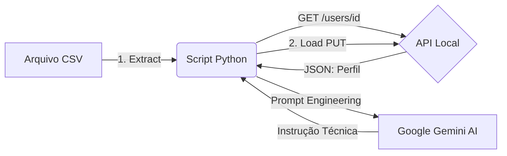

# ⚽ Pipeline ETL: Assistente Técnico de Alta Performance (IA)

## 📌 Visão Geral
Este projeto implementa um pipeline de dados **ETL (Extract, Transform, Load)** focado em **Sports Analytics**. Ele integra uma API de gestão de atletas com a Inteligência Artificial do Google para gerar feedbacks técnicos personalizados, desenvolvido como parte do desafio de projeto da **DIO**.

O diferencial deste projeto é a **Transformação Inteligente**: utilizamos o modelo **Gemini 1.5 Flash** para atuar como um treinador virtual, analisando a posição e o desempenho do jogador para criar instruções táticas sob medida.

---

## ⚙️ Arquitetura do Projeto

O fluxo de dados segue a estrutura abaixo:

### 🔍 Deep Dive no Código

#### 1. Extract (Extração)
* **Pandas**: Carregamento dos IDs dos atletas a partir do arquivo `jogadores.csv`.
* **Requests**: Consulta à API REST local para recuperar o perfil completo do jogador (Nome, Posição, Nível de Evolução).

#### 2. Transform (Transformação)
Utilizamos **Prompt Engineering** para garantir que a IA se comporte como um técnico profissional:
* **System Instruction**: O agente é configurado para ser um "Assistente Técnico de Alta Performance".
* **Contexto Dinâmico**: O prompt utiliza a posição do jogador (ex: Zagueiro, Atacante) para sugerir treinos específicos.

#### 3. Load (Carregamento)
* As mensagens geradas são enviadas de volta para a API original via requisição **PUT**, atualizando o campo de notícias do atleta.

---

### 🛠️ Tecnologias e Ferramentas
* **Linguagem**: Python.
* **Bibliotecas**: `pandas`, `requests`, `google-genai`.
* **IA**: Google Gemini 1.5 Flash.
* **Segurança**: Configurado via `.gitignore` para proteger chaves de API e ambientes virtuais.

---

### 🚀 Como Executar o Projeto
1. **Clone o repositório**:  
   `git clone https://github.com/ThalikParente/Fake-API-Santander-Dio.git`
2. **Instale as dependências**:  
   `pip install -r requirements.txt`
3. **Configure sua API Key**:  
   Adicione sua chave do Gemini em um arquivo `.env`.
4. **Rode o script**:  
   `python extract_transform_load.py`

---
Desenvolvido por **Thálik Parente** como parte da jornada de aprendizado em Engenharia de Dados na DIO.
